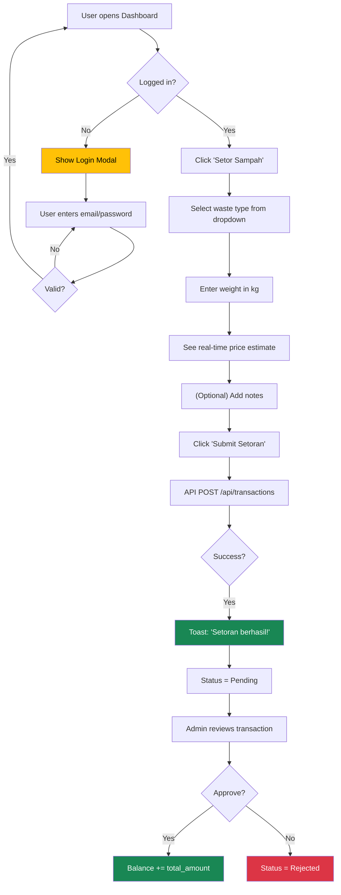
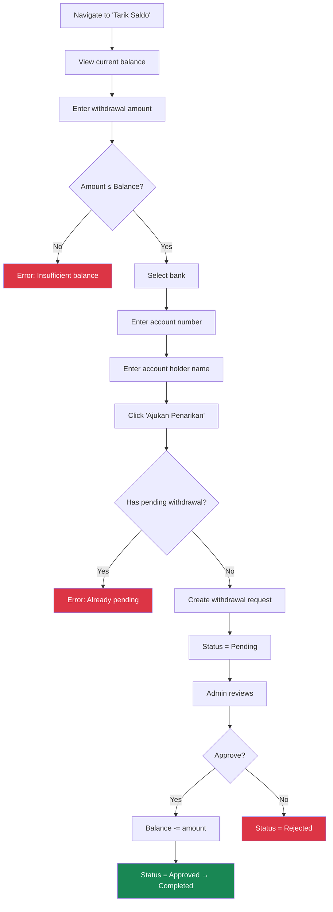
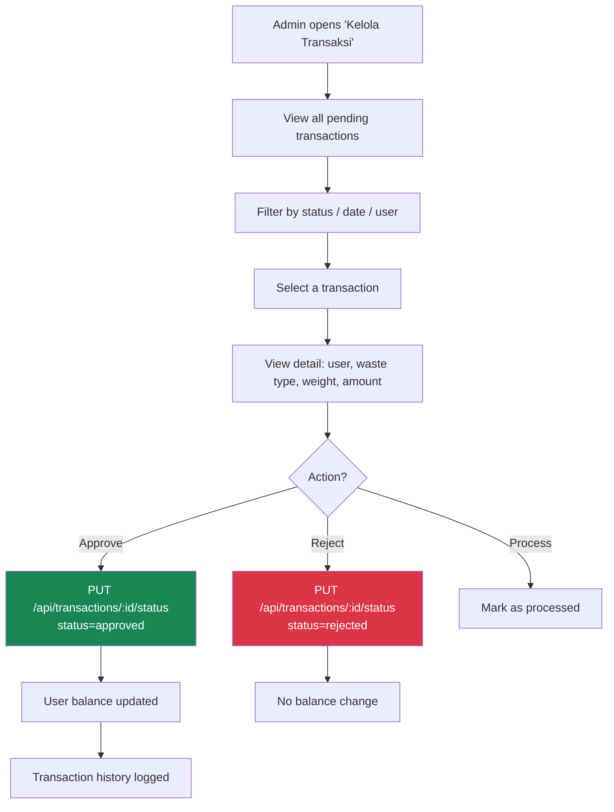
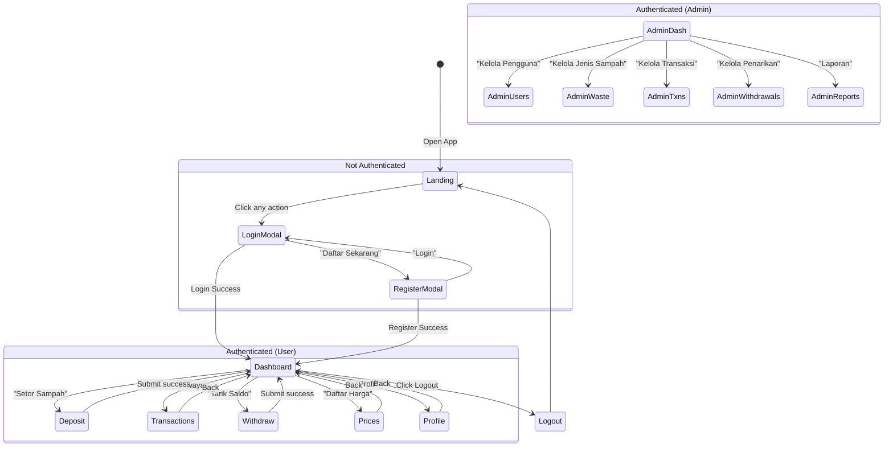

# Bank Sampah — Comprehensive UI/UX Plan

> **Project**: Bank Sampah (Community Waste Bank)
> **Tech Stack**: Node.js / Express / SQLite / Vanilla HTML-CSS-JS (AdminLTE-inspired)
> **Date**: 2026-02-13

---

## 1. Project Overview

Bank Sampah is a community-based waste management platform where **users** deposit recyclable waste at a collection point and earn credits (Rupiah). They can later withdraw their balance to a bank account. **Admins** manage waste types, approve/reject transactions, process withdrawals, and oversee all users.

### 1.1 User Roles

| Role | Description | Key Capabilities |
|------|-------------|-----------------|
| **User** (Nasabah) | Community member | Register, deposit waste, view balance, request withdrawals, view prices, edit profile |
| **Admin** (Petugas) | Bank Sampah operator | All user capabilities + manage users, manage waste types, approve/reject transactions & withdrawals, view global stats |

---

## 2. Information Architecture

### 2.1 Sitemap

```mermaid
graph TD
  ROOT["🏠 Bank Sampah App"]

  ROOT --> AUTH["🔐 Authentication"]
  AUTH --> LOGIN["Login Modal"]
  AUTH --> REGISTER["Register Modal"]

  ROOT --> USER["👤 User Pages"]
  USER --> DASH["📊 Dashboard"]
  USER --> DEPOSIT["♻️ Setor Sampah<br/>(Deposit Waste)"]
  USER --> TXNS["📋 Riwayat Transaksi<br/>(Transaction History)"]
  USER --> WITHDRAW["💰 Tarik Saldo<br/>(Withdraw Balance)"]
  USER --> PRICES["💲 Daftar Harga<br/>(Price List)"]
  USER --> PROFILE["👤 Profil<br/>(User Profile)"]

  ROOT --> ADMIN["🛡️ Admin Pages"]
  ADMIN --> ADMIN_DASH["📊 Admin Dashboard"]
  ADMIN --> ADMIN_USERS["👥 Kelola Pengguna<br/>(User Management)"]
  ADMIN --> ADMIN_WASTE["🗂️ Kelola Jenis Sampah<br/>(Waste Type Management)"]
  ADMIN --> ADMIN_TXNS["📋 Kelola Transaksi<br/>(Transaction Management)"]
  ADMIN --> ADMIN_WD["💰 Kelola Penarikan<br/>(Withdrawal Management)"]
  ADMIN --> ADMIN_REPORTS["📈 Laporan<br/>(Reports)"]

  style ROOT fill:#198754,color:#fff
  style AUTH fill:#6c757d,color:#fff
  style USER fill:#0d6efd,color:#fff
  style ADMIN fill:#dc3545,color:#fff
```



### 2.2 Navigation Structure

#### Sidebar Menu — User Role

| # | Icon | Label | Page ID | Notes |
|---|------|-------|---------|-------|
| — | — | **MENU UTAMA** | — | Section header |
| 1 | `bi-speedometer2` | Dashboard | `dashboard` | Default landing |
| 2 | `bi-recycle` | Setor Sampah | `deposit` | Deposit waste form |
| 3 | `bi-clock-history` | Riwayat Transaksi | `transactions` | Full transaction list |
| 4 | `bi-wallet2` | Tarik Saldo | `withdraw` | Withdrawal form & history |
| — | — | **INFORMASI** | — | Section header |
| 5 | `bi-tags` | Daftar Harga | `prices` | Public price catalog |
| — | — | **AKUN** | — | Section header |
| 6 | `bi-person-circle` | Profil Saya | `profile` | Profile & password |

#### Sidebar Menu — Admin Role (additional items)

| # | Icon | Label | Page ID | Notes |
|---|------|-------|---------|-------|
| — | — | **ADMINISTRASI** | — | Section header |
| 7 | `bi-people` | Kelola Pengguna | `admin-users` | CRUD users |
| 8 | `bi-trash3` | Kelola Jenis Sampah | `admin-waste` | CRUD waste types |
| 9 | `bi-receipt` | Kelola Transaksi | `admin-transactions` | Approve/reject all |
| 10 | `bi-cash-stack` | Kelola Penarikan | `admin-withdrawals` | Process withdrawals |
| 11 | `bi-bar-chart-line` | Laporan | `admin-reports` | Reports & stats |

---

## 3. User Flows

### 3.1 Core User Flow — Waste Deposit



### 3.2 Withdrawal Flow



### 3.3 Admin Transaction Management Flow



---

## 4. Design System

### 4.1 Color Palette

| Token | Color | Hex | Usage |
|-------|-------|-----|-------|
| Primary | 🔵 | `#0d6efd` | CTAs, links, active sidebar |
| Success | 🟢 | `#198754` | Deposits, positive actions, approved |
| Warning | 🟡 | `#ffc107` | Pending status, caution |
| Danger | 🔴 | `#dc3545` | Rejections, deletions, errors |
| Info | 🩵 | `#0dcaf0` | Statistics, informational |
| Secondary | ⚫ | `#6c757d` | Muted text, borders |
| Sidebar BG | ⬛ | `#343a40` | Dark sidebar background |
| Body BG | ⬜ | `#f4f6f9` | Page background |

### 4.2 Typography

| Element | Font | Size | Weight |
|---------|------|------|--------|
| Body | Source Sans Pro | 0.875rem (14px) | 400 |
| H1 / Page Title | Source Sans Pro | 1.5rem (24px) | 500 |
| H3 / Stat Number | Source Sans Pro | 2.25rem (36px) | 700 |
| Card Title | Source Sans Pro | 1.1rem (17.6px) | 500 |
| Table Header | Source Sans Pro | 0.875rem (14px) | 600 (uppercase) |
| Badge / Status | Source Sans Pro | 0.75rem (12px) | 500 |
| Small / Caption | Source Sans Pro | 0.75rem (12px) | 400 |

### 4.3 Layout Constants

| Token | Value | Description |
|-------|-------|-------------|
| `--lte-sidebar-width` | 250px | Open sidebar |
| `--lte-sidebar-mini-width` | 70px | Collapsed sidebar |
| `--lte-header-height` | 56px | Top navbar |
| `--lte-footer-height` | 50px | Bottom footer |
| Content padding | 1.5rem | `app-content` |
| Card border-radius | 0.5rem | All cards |
| Transition | 0.3s ease-in-out | Sidebar / layout |

### 4.4 Status Badge System

| Status | BG Color | Text Color | Label (ID) |
|--------|----------|------------|------------|
| Pending | `#fef3c7` | `#92400e` | Menunggu |
| Approved | `#dbeafe` | `#1e40af` | Disetujui |
| Processed / Completed | `#d1fae5` | `#065f46` | Selesai |
| Rejected | `#fee2e2` | `#991b1b` | Ditolak |

---

## 5. Component Inventory

### 5.1 Existing Components (in current codebase)

| Component | File | Description |
|-----------|------|-------------|
| Small Box (Stat Card) | `index.html` L104-160 | 4 colored stat boxes with icon, value, label, footer link |
| Info Box (Action Card) | `index.html` L163-212 | Gradient cards with icon, title, progress bar, CTA |
| Card | `style.css` L479-520 | Generic card with header/body/footer |
| Table (Responsive) | `index.html` | Striped, hoverable data tables |
| Status Badge | `style.css` L532-558 | Pill-shaped status indicator |
| Price Card | `style.css` L747-792 | Waste type price display card |
| Loading Overlay | `index.html` L647-652 | Full-screen spinner |
| Toast Notification | `app.js` `showToast()` | Top-right toast alerts |
| Login Modal | `index.html` L548-585 | Bootstrap modal with form |
| Register Modal | `index.html` L587-642 | Bootstrap modal with form |
| Pagination | `app.js` `renderPagination()` | Bootstrap small pagination |
| Sidebar Nav | `app.js` `updateAuthUI()` | Dynamically-generated sidebar menu |

### 5.2 Components to Add

| Component | Purpose | Priority |
|-----------|---------|----------|
| **Confirmation Dialog** | Confirm destructive actions (delete, reject) | High |
| **Transaction Detail Modal** | View full transaction info, admin actions | High |
| **User Detail Modal** | Admin view of user profile with balance info | High |
| **Waste Type Form Modal** | Create/edit waste type (admin) | High |
| **Stats Chart** | Monthly earnings chart (bar/line) | Medium |
| **Empty State** | Illustrated empty state for tables with 0 rows | Medium |
| **Skeleton Loader** | Card/table skeleton while data loads | Low |
| **Avatar** | User initials-based avatar circle | Low |
| **Search Bar** | Admin table search with debounce | Medium |
| **Date Range Picker** | Transaction filter by date range | Medium |
| **Export Button** | CSV/PDF export for admin reports | Low |

---

## 6. Page-by-Page Wireframes

### 6.1 Dashboard (User)

```
┌─────────────────────────────────────────────────────────────────────┐
│ ☰  Beranda   Daftar Harga                    🔔  👤 User Name ▾  │
├──────────┬──────────────────────────────────────────────────────────┤
│ ♻️ Bank  │  Dashboard                              Home > Dashboard│
│  Sampah  │──────────────────────────────────────────────────────────│
│          │                                                          │
│ MENU     │  ┌──────────┐ ┌──────────┐ ┌──────────┐ ┌──────────┐   │
│ ▪ 📊 Dash│  │ 🔵 SALDO │ │ 🟢 TRANS │ │ 🟡 BERAT │ │ 🔴 TOTAL │   │
│ ▪ ♻️ Setor│  │ Rp 45.000│ │    12    │ │  25.5 kg │ │ Rp 45.000│   │
│ ▪ 📋 Riw │  │ ▸ More   │ │ ▸ More   │ │ ▸ More   │ │ ▸ More   │   │
│ ▪ 💰 Tarik│  └──────────┘ └──────────┘ └──────────┘ └──────────┘   │
│          │                                                          │
│ INFORMASI│  ┌──────────────┐ ┌──────────────┐ ┌──────────────┐     │
│ ▪ 💲 Harga│  │ 🔵 Setor     │ │ 🟢 Tarik     │ │ 🩵 Statistik │     │
│          │  │  Sampah      │ │  Saldo       │ │  Laporan     │     │
│ AKUN     │  │ ▸ Mulai Setor│ │ ▸ Ajukan     │ │ ▸ Detail     │     │
│ ▪ 👤 Profil│  └──────────────┘ └──────────────┘ └──────────────┘     │
│          │                                                          │
│          │  ┌────────────────────────────────────────────────────┐  │
│          │  │ Transaksi Terbaru                    ▸ Lihat Semua│  │
│          │  ├────────┬──────────┬──────┬─────────┬──────────────┤  │
│          │  │Tanggal │Jenis     │Berat │Status   │Jumlah        │  │
│          │  ├────────┼──────────┼──────┼─────────┼──────────────┤  │
│          │  │10 Feb  │Botol PET │5 kg  │🟢Selesai│Rp 15.000     │  │
│          │  │08 Feb  │Kertas HVS│3 kg  │🟡Pending│Rp 9.000      │  │
│          │  │05 Feb  │Aluminium │1 kg  │🟢Selesai│Rp 15.000     │  │
│          │  └────────┴──────────┴──────┴─────────┴──────────────┘  │
│          │                                                          │
├──────────┴──────────────────────────────────────────────────────────┤
│  © 2024 Bank Sampah                              Bank Sampah v1.0  │
└─────────────────────────────────────────────────────────────────────┘
```

### 6.2 Setor Sampah (Deposit) Page

```
┌──────────────────────────────────────────────────────────────┐
│  Setor Sampah                          Home > Setor Sampah   │
├──────────────────────────────────┬───────────────────────────┤
│ ┌──────────────────────────────┐ │ ┌─────────────────────┐   │
│ │ Form Setor Sampah            │ │ │ Saldo Anda          │   │
│ │                              │ │ │                     │   │
│ │ Jenis Sampah    Berat (kg)   │ │ │    Rp 45.000        │   │
│ │ ┌────────────┐ ┌───────────┐ │ │ │   Saldo saat ini    │   │
│ │ │ Pilih ▾    │ │ 0.00      │ │ │ └─────────────────────┘   │
│ │ └────────────┘ └───────────┘ │ │                           │
│ │                              │ │ ┌─────────────────────┐   │
│ │ Catatan (Opsional)           │ │ │ Kategori Sampah     │   │
│ │ ┌────────────────────────┐   │ │ │                     │   │
│ │ │                        │   │ │ │ ▪ Plastik  (5 jenis)│   │
│ │ │                        │   │ │ │ ▪ Kertas   (4 jenis)│   │
│ │ └────────────────────────┘   │ │ │ ▪ Logam    (3 jenis)│   │
│ │                              │ │ │ ▪ Kaca     (2 jenis)│   │
│ │ ┌────────────────────────┐   │ │ │ ▪ Organik  (1 jenis)│   │
│ │ │ ℹ️ Harga/kg: Rp 3.000   │   │ │ └─────────────────────┘   │
│ │ │    Estimasi: Rp 15.000  │   │ │                           │
│ │ └────────────────────────┘   │ │                           │
│ │                              │ │                           │
│ │ [✅ Submit Setoran]          │ │                           │
│ └──────────────────────────────┘ │                           │
└──────────────────────────────────┴───────────────────────────┘
```

### 6.3 Riwayat Transaksi (Transaction History) Page

```
┌────────────────────────────────────────────────────────────────┐
│  Riwayat Transaksi                 Home > Riwayat Transaksi    │
├────────────────────────────────────────────────────────────────┤
│ ┌──────────────────────────────────────────────────────────┐   │
│ │ Riwayat Transaksi                [Status Filter ▾]       │   │
│ ├────┬──────────┬──────────┬──────┬────────┬───────┬──────┤   │
│ │ ID │ TANGGAL  │ JENIS    │BERAT │HARGA/KG│ TOTAL │STATUS│   │
│ ├────┼──────────┼──────────┼──────┼────────┼───────┼──────┤   │
│ │ 12 │ 10 Feb   │ Botol PET│ 5 kg │ 3.000  │15.000 │🟢   │   │
│ │ 11 │ 08 Feb   │ Kertas   │ 3 kg │ 3.000  │ 9.000 │🟡   │   │
│ │ 10 │ 05 Feb   │ Aluminum │ 1 kg │15.000  │15.000 │🟢   │   │
│ │  9 │ 01 Feb   │ Besi     │ 2 kg │ 5.000  │10.000 │🔴   │   │
│ ├────┴──────────┴──────────┴──────┴────────┴───────┴──────┤   │
│ │  « ‹ 1  2  3 › »                                        │   │
│ └──────────────────────────────────────────────────────────┘   │
└────────────────────────────────────────────────────────────────┘
```

### 6.4 Tarik Saldo (Withdraw) Page

```
┌──────────────────────────────────────────────────────────────┐
│  Tarik Saldo                           Home > Tarik Saldo    │
├──────────────────────────────┬───────────────────────────────┤
│ ┌──────────────────────────┐ │ ┌───────────────────────────┐ │
│ │ Form Penarikan Saldo     │ │ │ Riwayat Penarikan         │ │
│ │                          │ │ │                           │ │
│ │ Jumlah Penarikan         │ │ ├─────────┬──────┬────┬────┤ │
│ │ ┌─────┬──────────────┐   │ │ │TANGGAL  │ BANK │JML │STS │ │
│ │ │ Rp  │ 50.000       │   │ │ ├─────────┼──────┼────┼────┤ │
│ │ └─────┴──────────────┘   │ │ │ 10 Feb  │ BCA  │50K │🟡  │ │
│ │ Saldo: Rp 45.000         │ │ │ 01 Jan  │ BRI  │30K │🟢  │ │
│ │                          │ │ │ 15 Dec  │ BNI  │25K │🟢  │ │
│ │ Nama Bank                │ │ └─────────┴──────┴────┴────┘ │
│ │ ┌──────────────────────┐ │ │                               │
│ │ │ BCA               ▾  │ │ │                               │
│ │ └──────────────────────┘ │ │                               │
│ │                          │ │                               │
│ │ Nomor Rekening           │ │                               │
│ │ ┌──────────────────────┐ │ │                               │
│ │ │ 1234567890           │ │ │                               │
│ │ └──────────────────────┘ │ │                               │
│ │                          │ │                               │
│ │ Nama Pemilik Rekening    │ │                               │
│ │ ┌──────────────────────┐ │ │                               │
│ │ │ John Doe             │ │ │                               │
│ │ └──────────────────────┘ │ │                               │
│ │                          │ │                               │
│ │ [✅ Ajukan Penarikan]    │ │                               │
│ └──────────────────────────┘ │                               │
└──────────────────────────────┴───────────────────────────────┘
```

### 6.5 Daftar Harga (Price List) Page

```
┌──────────────────────────────────────────────────────────────┐
│  Daftar Harga                          Home > Daftar Harga   │
├──────────────────────────────────────────────────────────────┤
│                                                              │
│  ┌──────────────┐ ┌──────────────┐ ┌──────────────┐         │
│  │ PLASTIK      │ │ PLASTIK      │ │ PLASTIK      │         │
│  │              │ │              │ │              │         │
│  │ Botol PET    │ │ Plastik HDPE │ │ Plastik LDPE │         │
│  │              │ │              │ │              │         │
│  │ Rp 3.000/kg  │ │ Rp 4.000/kg  │ │ Rp 3.000/kg  │         │
│  │              │ │              │ │              │         │
│  │ Botol minuman│ │ Botol kosmetik│ │ Plastik      │         │
│  │ transparan   │ │ deterjen     │ │ kresek       │         │
│  └──────────────┘ └──────────────┘ └──────────────┘         │
│                                                              │
│  ┌──────────────┐ ┌──────────────┐ ┌──────────────┐         │
│  │ KERTAS       │ │ KERTAS       │ │ LOGAM        │         │
│  │              │ │              │ │              │         │
│  │ Kertas HVS   │ │ Karton       │ │ Aluminium    │         │
│  │              │ │              │ │              │         │
│  │ Rp 3.000/kg  │ │ Rp 2.500/kg  │ │ Rp 15.000/kg │         │
│  │              │ │              │ │              │         │
│  │ Kertas putih │ │ Dus kardus   │ │ Kaleng       │         │
│  │ A4           │ │              │ │ minuman      │         │
│  └──────────────┘ └──────────────┘ └──────────────┘         │
│                                                              │
└──────────────────────────────────────────────────────────────┘
```

### 6.6 Profil (Profile) Page

```
┌──────────────────────────────────────────────────────────────┐
│  Profil Saya                           Home > Profil Saya    │
├──────────────────┬───────────────────────────────────────────┤
│ ┌──────────────┐ │ ┌─────────────────────────────────────┐   │
│ │              │ │ │ Informasi Profil                    │   │
│ │   👤 (100px) │ │ │                                     │   │
│ │              │ │ │ Nama Lengkap    No. HP               │   │
│ │  John Doe    │ │ │ ┌─────────────┐ ┌──────────────────┐│   │
│ │  john@email  │ │ │ │ John Doe    │ │ 08123456789      ││   │
│ │              │ │ │ └─────────────┘ └──────────────────┘│   │
│ │ ┌──────────┐ │ │ │                                     │   │
│ │ │Rp 45.000 │ │ │ │ Alamat                              │   │
│ │ └──────────┘ │ │ │ ┌─────────────────────────────────┐ │   │
│ └──────────────┘ │ │ │ Jl. Hijau No. 10               │ │   │
│                  │ │ └─────────────────────────────────┘ │   │
│                  │ │ [✅ Simpan Perubahan]               │   │
│                  │ └─────────────────────────────────────┘   │
│                  │                                           │
│                  │ ┌─────────────────────────────────────┐   │
│                  │ │ Ubah Password                       │   │
│                  │ │ Password Saat Ini: [____________]   │   │
│                  │ │ Password Baru:     [____________]   │   │
│                  │ │ Konfirmasi:        [____________]   │   │
│                  │ │ [🔒 Ubah Password]                  │   │
│                  │ └─────────────────────────────────────┘   │
└──────────────────┴───────────────────────────────────────────┘
```

### 6.7 Login & Register Modals

```
┌─────── Login Modal ───────┐    ┌────── Register Modal ──────┐
│ 🔵 Login Bank Sampah    ✕ │    │ 🟢 Daftar Akun Baru     ✕ │
├───────────────────────────┤    ├───────────────────────────┤
│                           │    │                           │
│ Email                     │    │ Nama Lengkap              │
│ ┌───┬───────────────────┐ │    │ ┌───┬───────────────────┐ │
│ │ ✉ │ nama@email.com    │ │    │ │ 👤│ Masukkan nama     │ │
│ └───┴───────────────────┘ │    │ └───┴───────────────────┘ │
│                           │    │                           │
│ Password                  │    │ Email                     │
│ ┌───┬───────────────────┐ │    │ ┌───┬───────────────────┐ │
│ │ 🔒│ ••••••••          │ │    │ │ ✉ │ nama@email.com    │ │
│ └───┴───────────────────┘ │    │ └───┴───────────────────┘ │
│                           │    │                           │
│ ☐ Ingat Saya              │    │ No. HP (Opsional)         │
│                           │    │ ┌───┬───────────────────┐ │
│ [🔵 Masuk            ]    │    │ │ 📞│ 08xxxxxxxxxx      │ │
│                           │    │ └───┴───────────────────┘ │
│ Belum punya akun?         │    │                           │
│        Daftar Sekarang    │    │ Password                  │
│                           │    │ ┌───┬───────────────────┐ │
└───────────────────────────┘    │ │ 🔒│ Minimal 6 karakter│ │
                                 │ └───┴───────────────────┘ │
                                 │                           │
                                 │ Konfirmasi Password       │
                                 │ ┌───┬───────────────────┐ │
                                 │ │ 🔒│ Ulangi password    │ │
                                 │ └───┴───────────────────┘ │
                                 │                           │
                                 │ [🟢 Daftar            ]   │
                                 │                           │
                                 │ Sudah punya akun? Login   │
                                 └───────────────────────────┘
```

---

## 7. Admin Panel Wireframes

### 7.1 Admin Dashboard

```
┌────────────────────────────────────────────────────────────────┐
│  Admin Dashboard                     Home > Admin Dashboard    │
├────────────────────────────────────────────────────────────────┤
│                                                                │
│  ┌──────────┐ ┌──────────┐ ┌──────────┐ ┌──────────┐         │
│  │ 🔵 USERS │ │ 🟢 TRANS │ │ 🟡 PEND  │ │ 🔴 WITHD │         │
│  │    45    │ │   320    │ │    8     │ │    3     │         │
│  │Total User│ │Total Trx │ │Pending   │ │Pending WD│         │
│  └──────────┘ └──────────┘ └──────────┘ └──────────┘         │
│                                                                │
│  ┌──────────────────────────┐ ┌──────────────────────────┐    │
│  │ Transaksi Perlu Tindakan │ │ Penarikan Menunggu       │    │
│  ├──────┬─────┬──────┬─────┤ ├──────┬──────┬──────┬─────┤    │
│  │User  │Jenis│Jumlah│Aksi │ │User  │Bank  │Jumlah│Aksi │    │
│  ├──────┼─────┼──────┼─────┤ ├──────┼──────┼──────┼─────┤    │
│  │Budi  │PET  │15.000│✅❌ │ │Siti  │BCA   │50.000│✅❌ │    │
│  │Siti  │HVS  │ 9.000│✅❌ │ │Andi  │BRI   │30.000│✅❌ │    │
│  │Andi  │Iron │10.000│✅❌ │ └──────┴──────┴──────┴─────┘    │
│  └──────┴─────┴──────┴─────┘                                  │
│                                                                │
│  ┌────────────────────────────────────────────────────────┐    │
│  │ 📊 Statistik Bulanan (Bar Chart)                       │    │
│  │                                                        │    │
│  │  ▐█▌                                                   │    │
│  │  ▐█▌  ▐█▌                                              │    │
│  │  ▐█▌  ▐█▌  ▐█▌  ▐█▌                                   │    │
│  │  ▐█▌  ▐█▌  ▐█▌  ▐█▌  ▐█▌                              │    │
│  │  Jan   Feb   Mar  Apr  May                              │    │
│  └────────────────────────────────────────────────────────┘    │
└────────────────────────────────────────────────────────────────┘
```

### 7.2 Admin — Kelola Pengguna (User Management)

```
┌────────────────────────────────────────────────────────────────┐
│  Kelola Pengguna                     Home > Kelola Pengguna    │
├────────────────────────────────────────────────────────────────┤
│ ┌──────────────────────────────────────────────────────────┐   │
│ │ [🔍 Cari pengguna...] [Role: Semua ▾] [+ Tambah User]   │   │
│ ├────┬──────────┬────────────────┬──────┬────────┬────┬────┤   │
│ │ ID │ NAMA     │ EMAIL          │ ROLE │ SALDO  │STSQ│AKSI│   │
│ ├────┼──────────┼────────────────┼──────┼────────┼────┼────┤   │
│ │  1 │ Admin    │ admin@bs.com   │🔴Adm │ -      │ ✅ │👁️🗑️│   │
│ │  2 │ Budi P.  │ budi@email.com │🔵Usr │ 45.000 │ ✅ │👁️✏️🗑️│   │
│ │  3 │ Siti A.  │ siti@email.com │🔵Usr │ 32.500 │ ✅ │👁️✏️🗑️│   │
│ │  4 │ Andi R.  │ andi@email.com │🔵Usr │ 10.000 │ ❌ │👁️✏️🗑️│   │
│ ├────┴──────────┴────────────────┴──────┴────────┴────┴────┤   │
│ │  « ‹ 1  2  3 › »                           Total: 45    │   │
│ └──────────────────────────────────────────────────────────┘   │
└────────────────────────────────────────────────────────────────┘
```

### 7.3 Admin — Kelola Jenis Sampah (Waste Type Management)

```
┌────────────────────────────────────────────────────────────────┐
│  Kelola Jenis Sampah               Home > Kelola Jenis Sampah │
├────────────────────────────────────────────────────────────────┤
│ ┌──────────────────────────────────────────────────────────┐   │
│ │ [Kategori: Semua ▾]                   [+ Tambah Jenis]   │   │
│ ├────┬──────────────┬──────────┬─────────┬──────┬──────────┤   │
│ │ ID │ NAMA         │ KATEGORI │HARGA/KG │AKTIF │ AKSI     │   │
│ ├────┼──────────────┼──────────┼─────────┼──────┼──────────┤   │
│ │  1 │ Botol PET    │ Plastik  │ 3.000   │ ✅   │ ✏️ 🗑️    │   │
│ │  2 │ Plastik HDPE │ Plastik  │ 4.000   │ ✅   │ ✏️ 🗑️    │   │
│ │  3 │ Kertas Koran │ Kertas   │ 2.000   │ ✅   │ ✏️ 🗑️    │   │
│ │  4 │ Aluminium    │ Logam    │ 15.000  │ ✅   │ ✏️ 🗑️    │   │
│ │  5 │ Botol Kaca   │ Kaca     │ 1.000   │ ✅   │ ✏️ 🗑️    │   │
│ ├────┴──────────────┴──────────┴─────────┴──────┴──────────┤   │
│ │  Showing 1–5 of 15                                       │   │
│ └──────────────────────────────────────────────────────────┘   │
│                                                                │
│ ┌── Edit Waste Type Modal ──┐                                  │
│ │ ✏️ Edit Jenis Sampah     ✕│                                  │
│ ├───────────────────────────┤                                  │
│ │ Nama:     [Botol PET    ] │                                  │
│ │ Kategori: [Plastik    ▾ ] │                                  │
│ │ Harga/kg: [3000         ] │                                  │
│ │ Satuan:   [kg           ] │                                  │
│ │ Deskripsi:[Botol minuman] │                                  │
│ │ Aktif:    [✅]            │                                  │
│ │                           │                                  │
│ │ [Batal]     [💾 Simpan]   │                                  │
│ └───────────────────────────┘                                  │
└────────────────────────────────────────────────────────────────┘
```

### 7.4 Admin — Kelola Transaksi (Transaction Management)

```
┌────────────────────────────────────────────────────────────────┐
│  Kelola Transaksi                  Home > Kelola Transaksi     │
├────────────────────────────────────────────────────────────────┤
│ ┌──────────────────────────────────────────────────────────┐   │
│ │ Filters: [Status ▾] [Dari: 📅] [Sampai: 📅] [🔍 Cari]  │   │
│ ├────┬──────┬──────────┬──────────┬──────┬───────┬────┬────┤   │
│ │ ID │ USER │ TANGGAL  │ JENIS    │BERAT │ TOTAL │STS │AKSI│   │
│ ├────┼──────┼──────────┼──────────┼──────┼───────┼────┼────┤   │
│ │ 12 │ Budi │ 10 Feb   │Botol PET │ 5 kg │15.000 │🟡  │✅❌│   │
│ │ 11 │ Siti │ 08 Feb   │Kertas HVS│ 3 kg │ 9.000 │🟡  │✅❌│   │
│ │ 10 │ Andi │ 05 Feb   │Aluminium │ 1 kg │15.000 │🟢  │ — │   │
│ │  9 │ Budi │ 01 Feb   │Besi      │ 2 kg │10.000 │🔴  │ — │   │
│ ├────┴──────┴──────────┴──────────┴──────┴───────┴────┴────┤   │
│ │  « ‹ 1  2  3  ...  16 › »              Total: 320       │   │
│ └──────────────────────────────────────────────────────────┘   │
│                                                                │
│ ┌── Transaction Detail Modal ───┐                              │
│ │ 📋 Detail Transaksi #12     ✕ │                              │
│ ├───────────────────────────────┤                              │
│ │ Nasabah  : Budi Prasetyo      │                              │
│ │ Email    : budi@email.com     │                              │
│ │ Jenis    : Botol PET          │                              │
│ │ Kategori : Plastik            │                              │
│ │ Berat    : 5.00 kg            │                              │
│ │ Harga/kg : Rp 3.000           │                              │
│ │ Total    : Rp 15.000          │                              │
│ │ Status   : 🟡 Menunggu        │                              │
│ │ Catatan  : -                  │                              │
│ │ Tanggal  : 10 Feb 2026, 14:30 │                              │
│ │                               │                              │
│ │ [❌ Tolak]    [✅ Setujui]     │                              │
│ └───────────────────────────────┘                              │
└────────────────────────────────────────────────────────────────┘
```

### 7.5 Admin — Kelola Penarikan (Withdrawal Management)

```
┌────────────────────────────────────────────────────────────────┐
│  Kelola Penarikan                  Home > Kelola Penarikan     │
├────────────────────────────────────────────────────────────────┤
│ ┌──────────────────────────────────────────────────────────┐   │
│ │ Filters: [Status ▾]                                      │   │
│ ├────┬──────┬──────────┬──────┬────────────┬───────┬──┬────┤   │
│ │ ID │ USER │ TANGGAL  │ BANK │ NO. REK    │JUMLAH │ST│AKSI│   │
│ ├────┼──────┼──────────┼──────┼────────────┼───────┼──┼────┤   │
│ │  5 │ Siti │ 10 Feb   │ BCA  │ 1234567890 │50.000 │🟡│✅❌│   │
│ │  4 │ Andi │ 08 Feb   │ BRI  │ 9876543210 │30.000 │🟡│✅❌│   │
│ │  3 │ Budi │ 01 Feb   │ BNI  │ 5566778899 │25.000 │🟢│ — │   │
│ ├────┴──────┴──────────┴──────┴────────────┴───────┴──┴────┤   │
│ │  Showing 1–3 of 3                                        │   │
│ └──────────────────────────────────────────────────────────┘   │
│                                                                │
│ ┌──── Withdrawal Detail Modal ────┐                            │
│ │ 💰 Detail Penarikan #5        ✕ │                            │
│ ├─────────────────────────────────┤                            │
│ │ Nasabah   : Siti Aminah         │                            │
│ │ Bank      : BCA                 │                            │
│ │ No. Rek   : 1234567890          │                            │
│ │ Atas Nama : Siti Aminah         │                            │
│ │ Jumlah    : Rp 50.000           │                            │
│ │ Status    : 🟡 Menunggu          │                            │
│ │ Saldo User: Rp 78.000           │                            │
│ │                                 │                            │
│ │ Alasan Penolakan (jika ditolak) │                            │
│ │ ┌─────────────────────────────┐ │                            │
│ │ │                             │ │                            │
│ │ └─────────────────────────────┘ │                            │
│ │                                 │                            │
│ │ [❌ Tolak]    [✅ Setujui]       │                            │
│ └─────────────────────────────────┘                            │
└────────────────────────────────────────────────────────────────┘
```

---

## 8. Navigation Flow Diagram



---

## 9. Responsive Design Strategy

### 9.1 Breakpoint Matrix

| Breakpoint | Width | Sidebar | Stat Cards | Content Cols |
|------------|-------|---------|------------|-------------|
| **XS** (Mobile) | < 576px | Hidden overlay | 2 per row | Full width (12) |
| **SM** (Tablet portrait) | ≥ 576px | Hidden overlay | 2 per row | Full width (12) |
| **MD** (Tablet landscape) | ≥ 768px | Mini (70px) | 4 per row | 6 + 6 |
| **LG** (Desktop) | ≥ 992px | Full (250px) | 4 per row | 8 + 4 |
| **XL** (Wide desktop) | ≥ 1200px | Full (250px) | 4 per row | 8 + 4 |

### 9.2 Mobile Adaptations

| Element | Desktop | Mobile |
|---------|---------|--------|
| Sidebar | Fixed left, always visible | Hidden, hamburger toggle overlay |
| Stat boxes | 4 columns | 2 columns (stacked) |
| Deposit form | 8 + 4 col split | Full width, stacked |
| Withdraw form | 6 + 6 col split | Full width, stacked |
| Tables | Full columns visible | Horizontal scroll |
| Modals | Centered dialog | Full-screen bottom sheet |
| Footer | Fixed bottom | Relative (scrolls with content) |

---

## 10. Interaction Patterns

### 10.1 Micro-Interactions

| Action | Animation | Duration |
|--------|-----------|----------|
| Sidebar toggle | Slide + content resize | 300ms ease-in-out |
| Page switch | Fade in | 200ms |
| Stat card hover | Icon scale 1.1x | 300ms linear |
| Price card hover | translateY(-2px) + shadow | 200ms |
| Button click | Scale 0.95 → 1.0 | 150ms |
| Toast appear | Slide down from top-right | 300ms |
| Toast dismiss | Fade out | 300ms, after 3s auto |
| Modal open | Fade + scale from 0.9 | 200ms |
| Loading overlay | Spinner rotate | Continuous |
| Status badge | No animation (static) | — |
| Table row hover | Background highlight | 100ms |

### 10.2 Form Validation UX

| Field | Validation | Feedback |
|-------|-----------|----------|
| Email | Format check | Red border + "Format email tidak valid" |
| Password | Min 6 chars | Red border + "Minimal 6 karakter" |
| Confirm Password | Must match | Red border + "Password tidak cocok" |
| Weight | > 0, max 1000 | Red border + "Berat tidak valid" |
| Withdrawal Amount | ≥ 10000, ≤ balance | Red border + "Saldo tidak cukup" |
| Bank Account | Required | Red border + "Wajib diisi" |
| All required fields | Non-empty | Red border disappears on valid input |

### 10.3 Toast Notification Types

| Type | Color | Icon | Example |
|------|-------|------|---------|
| Success | `#198754` | `bi-check-circle` | "Setoran berhasil disubmit!" |
| Error | `#dc3545` | `bi-exclamation-triangle` | "Gagal menyetor, coba lagi" |
| Warning | `#ffc107` | `bi-exclamation-circle` | "Saldo tidak mencukupi" |
| Info | `#0dcaf0` | `bi-info-circle` | "Transaksi sedang diproses" |

---

## 11. Data Flow Summary

### 11.1 API Endpoints by Page

| Page | Endpoint(s) | Method |
|------|------------|--------|
| **Dashboard** | `/api/transactions/stats/summary` | GET |
| | `/api/transactions?limit=5` | GET |
| **Deposit** | `/api/waste/types` | GET |
| | `/api/waste/categories` | GET |
| | `/api/auth/me` (balance) | GET |
| | `/api/transactions` | POST |
| **Transactions** | `/api/transactions` | GET |
| **Withdraw** | `/api/auth/me` (balance) | GET |
| | `/api/withdrawals` | GET, POST |
| **Prices** | `/api/waste/prices` | GET |
| **Profile** | `/api/auth/me` | GET |
| | `/api/users/:id` | PUT |
| | `/api/auth/password` | PUT |
| **Admin Users** | `/api/users` | GET |
| | `/api/users/:id` | GET, PUT, DELETE |
| | `/api/users/:id/status` | PUT |
| **Admin Waste** | `/api/waste/types` | GET, POST |
| | `/api/waste/types/:id` | PUT, DELETE |
| **Admin Txns** | `/api/transactions` | GET |
| | `/api/transactions/:id/status` | PUT |
| **Admin Withdrawals** | `/api/withdrawals` | GET |
| | `/api/withdrawals/:id/status` | PUT |
| | `/api/withdrawals/stats/summary` | GET |

---

## 12. Accessibility Checklist

| Requirement | Implementation |
|-------------|---------------|
| Keyboard navigation | All interactive elements are focusable, sidebar items have tabindex |
| Screen reader labels | `aria-label` on icon-only buttons, `role="navigation"` on sidebar |
| Color contrast | WCAG AA compliant (≥ 4.5:1 for text), verified on all status badges |
| Focus indicators | Visible focus ring on all form controls and buttons |
| Error messaging | `aria-live="polite"` on toast container, `aria-invalid` on form fields |
| Skip links | "Skip to main content" hidden link at top of page |
| Semantic HTML | `<nav>`, `<main>`, `<aside>`, `<header>`, `<footer>` used correctly |
| Image alt text | All SVG icons have descriptive title elements |

---

## 13. Current vs. Proposed Comparison

| Feature | Current State | Proposed Enhancement |
|---------|--------------|---------------------|
| Pages | 6 (dashboard, deposit, txns, withdraw, prices, profile) | **12** (add 6 admin pages) |
| Admin panel | ❌ Missing | ✅ Full admin CRUD for users, waste, txns, withdrawals |
| Transaction detail view | ❌ None | ✅ Modal with full details + admin actions |
| Confirmation dialogs | ❌ None | ✅ Before delete/reject actions |
| Empty states | Basic "Belum ada" text | ✅ Illustrated empty states |
| Date filters | ❌ None | ✅ Date range picker for transactions |
| Search | ❌ None | ✅ Search bar in admin tables |
| Charts | ❌ None | ✅ Monthly stats bar chart |
| Mobile sidebar | Partially works | ✅ Full overlay with backdrop |
| PWA support | ❌ None | 🔲 Future: manifest.json + service worker |

---

> **This document serves as the UI/UX blueprint for the Bank Sampah frontend.** All new pages follow AdminLTE-inspired layout conventions already established in the codebase. The existing CSS design system (`style.css`) and JS architecture (`app.js`) can be extended without introducing new frameworks.
